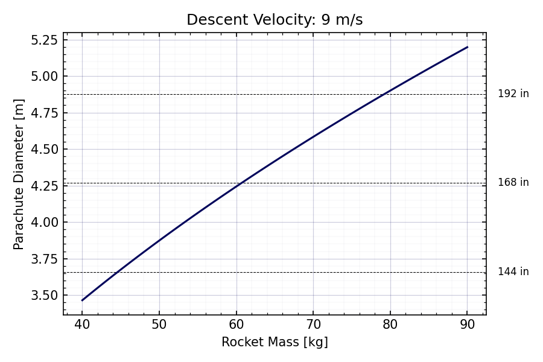

# Parachute-Sizing

Application to calculate the parachute diameter required for a given mass and descent velocity, considering varying air densities at different altitudes. 

## Usage

1. Run the script:
   ```bash
   python interface.py
   ```

2. **Input Parameters**:
   - **Minimum Mass (kg)**: Lower bound of the rocket mass range.
   - **Maximum Mass (kg)**: Upper bound of the rocket mass range.
   - **Descent Velocity (m/s)**: Target descent velocity.
   - **Drag Coefficient**: Coefficient of drag for the parachute.
   - **Apogee Altitude**: Select from 3 km, 6 km, or 9 km (air density adjusts automatically).

3. **Update Plot**:
   - Click the **Update Plot** button to calculate and display the results.

4. **Plot Description**:
   - **Blue Curve**: Required parachute diameter for the specified mass range.
   - **Dashed Black Lines**: Standard Rocketman parachute sizes with labels in inches.

## Output


